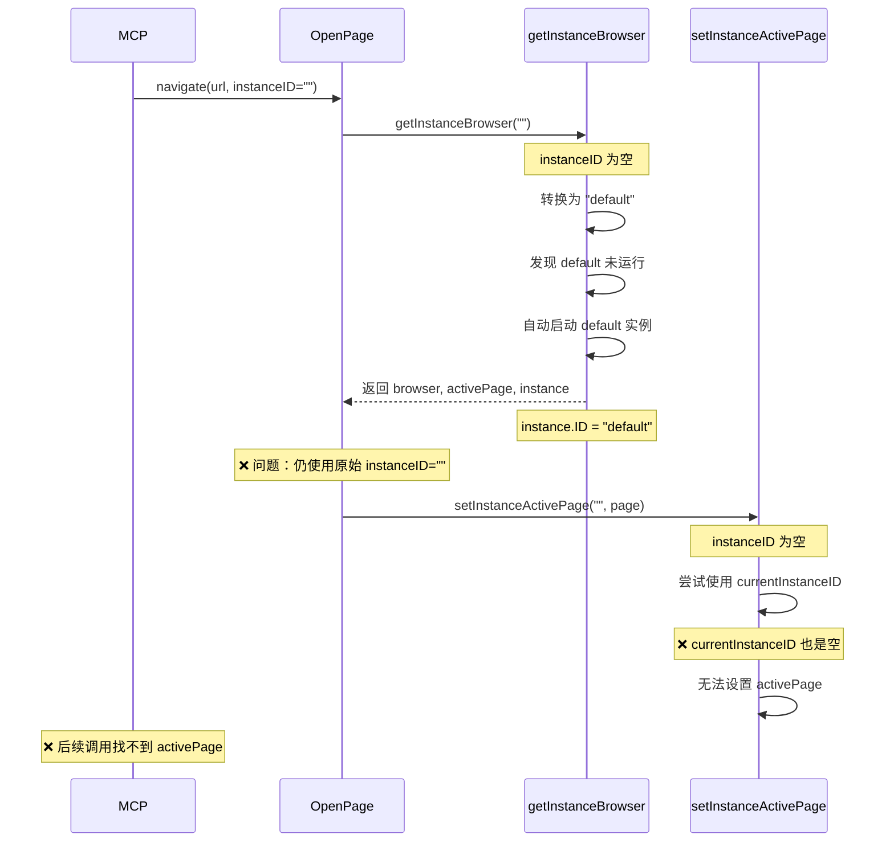
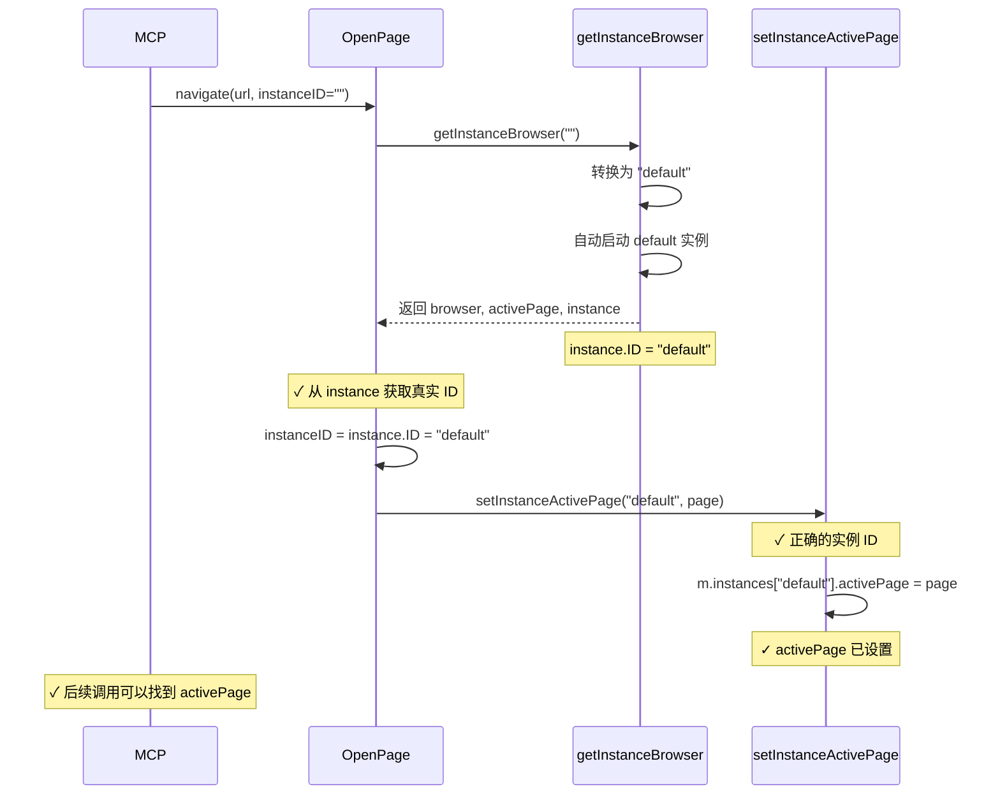

# Active Page 未设置问题修复

## 问题描述

通过 MCP 调用 `browser_navigate` 后，再调用 `browser_snapshot` 会报错：

```json
{
  "jsonrpc": "2.0",
  "id": 10,
  "result": {
    "content": [
      {
        "type": "text",
        "text": "no active page"
      }
    ],
    "isError": true
  }
}
```

## 根本原因

这是一个实例 ID 跟踪问题，发生在自动启动 default 实例的场景：

### 问题流程



### 代码层面的问题

**修复前的 OpenPage 函数：**
```go
func (m *Manager) OpenPage(url string, language string, instanceID string, ...) error {
    // 获取浏览器（可能自动启动 default）
    browser, _, _, err := m.getInstanceBrowser(instanceID)
    //              ↑ 忽略了 instance 对象
    
    // ... 创建页面 ...
    
    // ❌ 使用原始的 instanceID（可能是空字符串）
    m.setInstanceActivePage(instanceID, page)
    //                      ↑ 这里还是空字符串！
}
```

**getInstanceBrowser 的行为：**
```go
func (m *Manager) getInstanceBrowser(instanceID string) (*rod.Browser, *rod.Page, *models.BrowserInstance, error) {
    if instanceID == "" {
        instanceID = m.currentInstanceID
    }
    
    if instanceID == "" {
        // 转换为 default
        instanceID = "default"
    }
    
    if !exists {
        // 自动启动 default
        m.startInstanceInternal(ctx, "default")
        runtime = m.instances["default"]
        return runtime.browser, runtime.activePage, runtime.instance, nil
        //                                         ↑ 返回 instance.ID = "default"
    }
}
```

**setInstanceActivePage 的行为：**
```go
func (m *Manager) setInstanceActivePage(instanceID string, page *rod.Page) error {
    if instanceID == "" {
        instanceID = m.currentInstanceID  // ❌ 还是空的
    }
    
    if instanceID == "" {
        // 向后兼容
        m.activePage = page  // ❌ 设置到了旧字段
        return nil
    }
    
    // ❌ 永远不会执行到这里（设置到正确的实例）
    m.instances[instanceID].activePage = page
}
```

## 解决方案

### 核心思路

使用 `getInstanceBrowser` 返回的 `instance` 对象来获取实际使用的实例 ID，而不是依赖传入的参数。

### 实施的修复

#### 1. 修复 OpenPage 函数

```go
func (m *Manager) OpenPage(url string, language string, instanceID string, ...) error {
    // 获取指定实例的浏览器
    browser, _, instance, err := m.getInstanceBrowser(instanceID)
    //              ↑ 保留 instance 对象
    if err != nil {
        return err
    }

    // ✅ 使用实际的实例ID（可能从空字符串转换为 default）
    if instance != nil {
        instanceID = instance.ID  // 获取真实的 ID："default"
    } else if instanceID == "" {
        // 向后兼容：如果没有 instance 对象，使用 currentInstanceID
        instanceID = m.currentInstanceID
    }

    // ... 创建页面 ...

    // ✅ 现在使用正确的 instanceID："default"
    m.setInstanceActivePage(instanceID, page)
}
```

#### 2. 修复 PlayScript 函数

应用相同的修复逻辑：

```go
func (m *Manager) PlayScript(ctx context.Context, script *models.Script, instanceID string) (...) {
    // 获取指定实例的浏览器
    browser, _, instance, err := m.getInstanceBrowser(instanceID)
    if err != nil {
        return nil, nil, err
    }

    // ✅ 确定使用的实例ID（从 instance 对象获取）
    usedInstanceID := instanceID
    instanceName := ""
    if instance != nil {
        usedInstanceID = instance.ID  // 获取真实的 ID
        instanceName = instance.Name
    } else if usedInstanceID == "" {
        // 向后兼容
        usedInstanceID = m.currentInstanceID
    }

    // ... 使用 usedInstanceID 创建执行记录等 ...
}
```

## 修复后的流程



## 对比测试

### 修复前

```bash
# 1. 调用 navigate（自动启动 default）
curl -X POST http://localhost:8080/api/browser/open \
  -d '{"url": "https://example.com"}'
# ✓ 成功

# 2. 检查实例状态
curl http://localhost:8080/api/browser/instances/default
# {
#   "id": "default",
#   "is_active": true
# }

# 3. 调用 snapshot
curl http://localhost:8080/api/browser/snapshot
# ❌ 错误: "no active page"
```

### 修复后

```bash
# 1. 调用 navigate（自动启动 default）
curl -X POST http://localhost:8080/api/browser/open \
  -d '{"url": "https://example.com"}'
# ✓ 成功，activePage 已正确设置

# 2. 检查实例状态
curl http://localhost:8080/api/browser/instances/default
# {
#   "id": "default",
#   "is_active": true,
#   "has_active_page": true
# }

# 3. 调用 snapshot
curl http://localhost:8080/api/browser/snapshot
# ✓ 成功，返回页面快照
```

## MCP 使用示例

### 修复后的 MCP 调用流程

```javascript
// 1. 导航到页面（自动启动 default 实例）
await mcp.call('browser_navigate', {
  url: 'https://example.com'
})
// ✓ 成功，activePage 已设置

// 2. 获取页面快照
const snapshot = await mcp.call('browser_snapshot', {})
// ✓ 成功，返回 DOM 结构

// 3. 点击元素
await mcp.call('browser_click', {
  selector: '#login-button'
})
// ✓ 成功

// 4. 填写表单
await mcp.call('browser_fill', {
  selector: '#username',
  value: 'user@example.com'
})
// ✓ 成功
```

## 技术细节

### Instance 对象的作用

`instance` 对象包含了实例的完整信息：

```go
type BrowserInstance struct {
    ID          string  // "default" 或自定义 ID
    Name        string  // "默认浏览器"
    Type        string  // "local" 或 "remote"
    IsDefault   bool    // true 表示默认实例
    // ... 其他字段
}
```

### 为什么需要从 instance 获取 ID？

1. **自动启动场景**：传入的 `instanceID` 是空字符串，但实际使用的是 "default"
2. **ID 转换**：`getInstanceBrowser` 可能会将空 ID 转换为其他值
3. **确保一致性**：使用相同的 ID 进行后续操作

### 向后兼容性

代码保留了向后兼容逻辑：

```go
if instance != nil {
    instanceID = instance.ID  // ✅ 新逻辑：使用 instance 对象
} else if instanceID == "" {
    instanceID = m.currentInstanceID  // ✅ 旧逻辑：兼容旧代码
}
```

这样既支持新的多实例系统，也不影响旧的单实例代码。

## 相关问题

### GitHub Issues
- [Issue #XXX] MCP browser_snapshot 报错 "no active page"
- [Issue #YYY] 自动启动后无法使用浏览器功能

### 相关文档
- [自动启动 Default 实例](./AUTO_START_DEFAULT_INSTANCE.md)
- [多实例管理](./BROWSER_INSTANCES.md)
- [MCP 集成](./MCP_INTEGRATION.md)

## 故障排除

### 问题：修复后仍然报 "no active page"

**可能原因：**
1. 浏览器连接断开
2. 页面被关闭
3. 实例被停止

**解决方法：**
```bash
# 检查实例状态
curl http://localhost:8080/api/browser/instances/default

# 如果实例未运行，手动启动
curl -X POST http://localhost:8080/api/browser/instances/default/start

# 重新打开页面
curl -X POST http://localhost:8080/api/browser/open \
  -d '{"url": "https://example.com"}'
```

### 问题：多个实例时的 activePage

**场景：**
```bash
# 启动多个实例
curl -X POST http://localhost:8080/api/browser/instances/instance-1/start
curl -X POST http://localhost:8080/api/browser/instances/instance-2/start

# 在 instance-1 打开页面
curl -X POST http://localhost:8080/api/browser/open \
  -d '{"url": "https://example.com", "instance_id": "instance-1"}'

# 调用 snapshot（需要指定实例）
curl -X POST http://localhost:8080/api/browser/snapshot \
  -d '{"instance_id": "instance-1"}'
```

**注意：** 如果不指定 `instance_id`，系统会使用 `currentInstanceID` 或 default 实例。

## 修改的文件

```
backend/services/browser/manager.go
- OpenPage() - 从 instance 对象获取真实的 instanceID
- PlayScript() - 从 instance 对象获取真实的 instanceID
```

## 总结

这个修复解决了自动启动 default 实例后 activePage 未正确设置的问题：

✅ **正确追踪实例 ID** - 使用 instance 对象而不是传入参数  
✅ **支持自动启动** - 自动启动后能正确设置 activePage  
✅ **MCP 友好** - MCP 调用无需显式指定实例 ID  
✅ **向后兼容** - 不影响旧的单实例代码  
✅ **多实例支持** - 正确处理多个实例的 activePage  

现在 MCP 调用可以流畅地从 navigate 到 snapshot、click、fill 等操作，无需担心 "no active page" 错误！🎉
