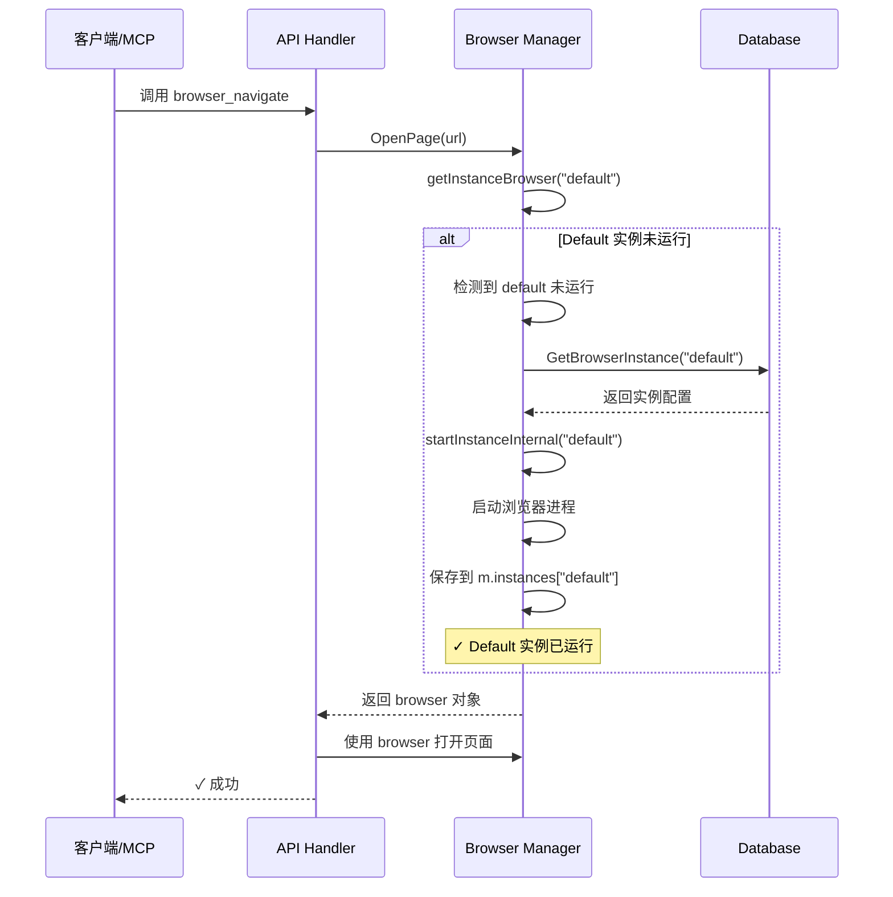

# Default 实例自动启动功能

## 问题描述

在使用 MCP（Model Context Protocol）或 API 调用时，如果 default 浏览器实例未启动，会收到错误：

```
instance default is not running
```

这要求用户手动启动浏览器实例，体验不够流畅，特别是对于：
- MCP 工具调用（AI 自动化）
- API 脚本调用
- 首次使用场景

## 解决方案

实现了 **default 实例自动启动**功能。当检测到 default 实例未运行时，系统会自动启动它。

### 核心改进

#### 1. **智能实例获取**

`getInstanceBrowser()` 函数现在会：

```go
func (m *Manager) getInstanceBrowser(instanceID string) (*rod.Browser, *rod.Page, *models.BrowserInstance, error) {
    // 1. 如果未指定实例ID，尝试使用当前实例
    if instanceID == "" {
        instanceID = m.currentInstanceID
    }
    
    // 2. 如果还是空，默认使用 "default"
    if instanceID == "" {
        instanceID = "default"
        logger.Info(ctx, "No current instance, attempting to use default instance")
    }
    
    // 3. 检查实例是否运行
    runtime, exists := m.instances[instanceID]
    if !exists || runtime == nil {
        // 4. 如果是 default 实例，自动启动
        if instanceID == "default" {
            logger.Info(ctx, "Default instance not running, attempting to auto-start...")
            err := m.startInstanceInternal(ctx, "default")
            if err != nil {
                return nil, nil, nil, fmt.Errorf("failed to start: %w", err)
            }
            logger.Info(ctx, "✓ Default instance auto-started successfully")
            // 重新获取运行时信息
            runtime = m.instances["default"]
        }
    }
    
    return runtime.browser, runtime.activePage, runtime.instance, nil
}
```

#### 2. **内部启动函数**

为了避免锁冲突，创建了 `startInstanceInternal()` 函数：

```go
// StartInstance - 公开接口（会获取锁）
func (m *Manager) StartInstance(ctx context.Context, instanceID string) error {
    m.mu.Lock()
    defer m.mu.Unlock()
    return m.startInstanceInternal(ctx, instanceID)
}

// startInstanceInternal - 内部函数（调用者必须已持有锁）
func (m *Manager) startInstanceInternal(ctx context.Context, instanceID string) error {
    // ... 启动逻辑
}
```

**为什么需要两个函数？**
- `getInstanceBrowser` 的调用者（如 `OpenPage`、`PlayScript`）已经持有锁
- 如果直接调用 `StartInstance`，会导致死锁（尝试再次获取已持有的锁）
- `startInstanceInternal` 假设调用者已持有锁，避免死锁

## 使用场景

### 场景 1: MCP 工具调用

**之前**：
```bash
# MCP 调用 browser_navigate
Error: instance default is not running

# 用户需要先手动启动
curl -X POST http://localhost:8080/api/browser/instances/default/start
```

**现在**：
```bash
# MCP 直接调用 browser_navigate
# ✓ 自动启动 default 实例
# ✓ 导航到目标页面
```

### 场景 2: API 脚本调用

**之前**：
```python
# 打开页面失败
response = requests.post('http://localhost:8080/api/browser/open', 
                        json={'url': 'https://example.com'})
# Error: instance default is not running

# 需要先启动
requests.post('http://localhost:8080/api/browser/instances/default/start')
```

**现在**：
```python
# 直接打开页面，自动启动实例
response = requests.post('http://localhost:8080/api/browser/open', 
                        json={'url': 'https://example.com'})
# ✓ 成功
```

### 场景 3: 首次使用

**之前**：
```
用户 -> 调用 API -> 失败（实例未启动）
     -> 查看文档 -> 学习如何启动实例
     -> 手动启动 -> 重新调用 API
```

**现在**：
```
用户 -> 调用 API -> ✓ 自动启动 -> 成功
```

## 技术细节

### 自动启动流程



### 锁管理

**调用链：**
```
OpenPage()
  ├─ m.mu.Lock()  ← 获取锁
  ├─ getInstanceBrowser()
  │   └─ startInstanceInternal()  ← 使用已有的锁
  └─ m.mu.Unlock()  ← 释放锁
```

**关键点：**
- ✅ 避免死锁：使用 `startInstanceInternal` 而不是 `StartInstance`
- ✅ 线程安全：所有操作在同一个锁保护下
- ✅ 性能：不会引入额外的锁等待

### 仅限 Default 实例

**为什么只自动启动 default？**

1. **安全性**：default 是系统默认实例，配置已知且可信
2. **用户意图**：如果未指定实例，用户期望使用 default
3. **避免混淆**：其他自定义实例需要显式启动，避免意外行为

**其他实例的行为**：
```go
// 显式指定非 default 实例
err := m.OpenPage(url, "", "my-custom-instance")
// ❌ 如果未运行，返回错误（不会自动启动）
// Error: instance my-custom-instance is not running
```

### 错误处理

```go
// 场景 1: Default 实例配置不存在
err := m.getInstanceBrowser("")
// Error: failed to load instance: browser instance not found

// 场景 2: 启动失败（如 Chrome 未安装）
err := m.getInstanceBrowser("")
// Error: default instance not running and failed to start: 
//        failed to start browser: exec: "chrome": executable file not found

// 场景 3: 启动后运行时信息丢失（极少见）
err := m.getInstanceBrowser("")
// Error: default instance started but runtime not found
```

## 日志输出

启用自动启动功能后，日志会清楚显示：

```
[INFO] No current instance, attempting to use default instance
[INFO] Default instance not running, attempting to auto-start...
[INFO] Starting browser instance: 默认浏览器 (local)
[INFO] Starting local browser instance...
[INFO] Using browser path: /usr/bin/google-chrome
[INFO] Browser started with PID: 12345
[INFO] ✓ Default instance auto-started successfully
[INFO] Using Stealth mode
[INFO] Navigating to: https://example.com
```

## 配置要求

确保 default 实例已在数据库中配置（系统启动时自动创建）：

```json
{
  "id": "default",
  "name": "默认浏览器",
  "type": "local",
  "bin_path": "/usr/bin/google-chrome",
  "user_data_dir": "~/.browserwing/default-profile",
  "is_default": true
}
```

如果数据库中不存在 default 实例，自动启动会失败。

## 向后兼容性

✅ 完全向后兼容：
- 已运行的实例不受影响
- 显式启动实例的 API 照常工作
- 旧代码无需修改

## 测试验证

### 测试 1: 自动启动

```bash
# 确保没有运行的实例
curl -X POST http://localhost:8080/api/browser/instances/default/stop

# 直接打开页面（应该自动启动）
curl -X POST http://localhost:8080/api/browser/open \
  -H "Content-Type: application/json" \
  -d '{"url": "https://example.com"}'

# 预期: ✓ 成功，日志显示自动启动
```

### 测试 2: MCP 调用

```javascript
// Cursor IDE 中使用 MCP
// 即使浏览器未启动，也能直接调用
await mcp.call('browser_navigate', { url: 'https://example.com' })
// ✓ 自动启动并导航
```

### 测试 3: 脚本回放

```bash
# 停止实例
curl -X POST http://localhost:8080/api/browser/instances/default/stop

# 回放脚本（应该自动启动）
curl -X POST http://localhost:8080/api/scripts/{scriptId}/play

# 预期: ✓ 成功回放
```

## 性能影响

- **首次调用延迟**：+2-5秒（启动浏览器的时间）
- **后续调用**：无额外开销（实例已运行）
- **内存使用**：无变化
- **CPU 使用**：启动时有短暂峰值

## 已知限制

1. **仅 Default 实例**：其他实例仍需手动启动
2. **启动失败**：如果 Chrome 未安装或配置错误，会返回错误
3. **并发启动**：多个并发请求可能尝试同时启动，但有锁保护

## 后续改进建议

### 1. 支持自定义实例自动启动

```go
// 配置哪些实例可以自动启动
type BrowserInstance struct {
    ID          string
    Name        string
    AutoStart   bool  // 新增字段
}
```

### 2. 实例健康检查

```go
// 定期检查实例是否还活着
func (m *Manager) StartHealthCheck() {
    ticker := time.NewTicker(30 * time.Second)
    for range ticker.C {
        if err := checkBrowserConnection(m.browser); err != nil {
            // 自动重启
            m.RestartInstance("default")
        }
    }
}
```

### 3. 启动策略配置

```yaml
# config.yaml
browser:
  auto_start:
    enabled: true
    instances: ["default", "my-custom"]
    retry_times: 3
    retry_delay: 5s
```

## 修改的文件

```
backend/services/browser/manager.go
- getInstanceBrowser() - 添加自动启动逻辑
- StartInstance() - 重构为调用 startInstanceInternal()
- startInstanceInternal() - 新增内部启动函数（不获取锁）
```

## 相关功能

- [浏览器实例管理](./BROWSER_INSTANCES.md)
- [MCP 集成](./MCP_INTEGRATION.md)
- [API 文档](./EXECUTOR_HTTP_API.md)

## 总结

这个改进显著提升了用户体验：

✅ **零配置使用**：首次调用自动启动 default 实例  
✅ **MCP 友好**：AI 工具可以直接调用，无需预先启动  
✅ **API 简化**：脚本调用更简单，减少一步启动操作  
✅ **向后兼容**：不影响现有功能  
✅ **安全可靠**：仅限 default 实例，有完整错误处理  

让 BrowserWing 更易用，更智能！🚀
