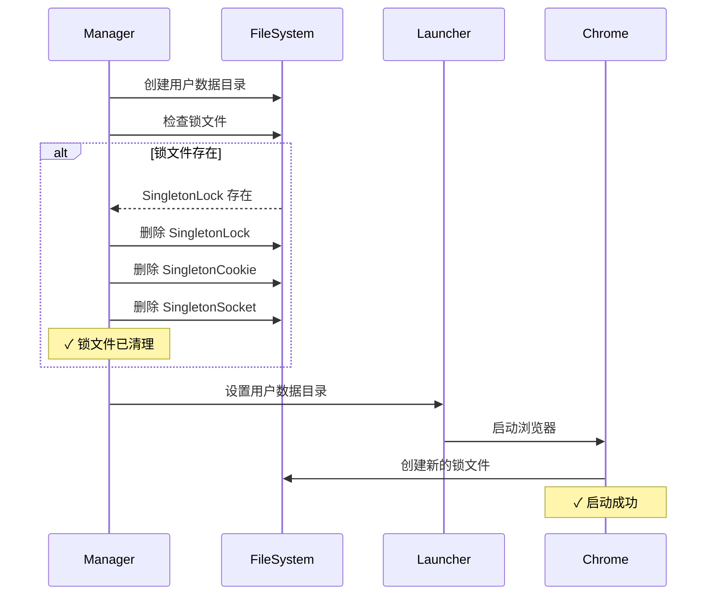

# Chrome SingletonLock 错误修复

## 问题描述

在启动浏览器实例时，会遇到以下错误：

```
failed to start browser: [launcher] Failed to get the debug url: 
[96588:41388051:0125/140803.805747:ERROR:chrome/browser/process_singleton_posix.cc:345] 
Failed to create /Users/chicken/code/browserwing_test/chrome_user_data/SingletonLock: File exists (17)

[96588:41388051:0125/140803.805901:ERROR:chrome/app/chrome_main_delegate.cc:510] 
Failed to create a ProcessSingleton for your profile directory. This means that running 
multiple instances would start multiple browser processes rather than opening a new window 
in the existing process. Aborting now to avoid profile corruption.
```

## 根本原因

Chrome 使用进程单例（ProcessSingleton）机制来确保同一个用户数据目录只被一个 Chrome 进程使用。这个机制通过在用户数据目录中创建锁文件来实现：

1. **SingletonLock** - 主锁文件
2. **SingletonCookie** - Cookie 文件
3. **SingletonSocket** - Unix Socket 文件（用于进程间通信）

### 问题场景

**场景 1：异常退出**
```
Chrome 进程崩溃或被强制终止
  ↓
锁文件没有被正确清理
  ↓
下次启动时检测到锁文件存在
  ↓
❌ 启动失败
```

**场景 2：多实例冲突**
```
用户手动启动了 Chrome（使用相同的用户数据目录）
  ↓
BrowserWing 尝试启动另一个实例
  ↓
检测到已有进程在使用该目录
  ↓
❌ 启动失败
```

**场景 3：文件系统问题**
```
文件系统错误或权限问题
  ↓
锁文件无法正常删除
  ↓
下次启动时仍然存在
  ↓
❌ 启动失败
```

## 解决方案

### 实施的修复

添加了启动前的锁文件清理机制：

```go
// cleanupSingletonLock 清理 Chrome 的进程单例锁文件
func (m *Manager) cleanupSingletonLock(ctx context.Context, userDataDir string) error {
    // Chrome 在用户数据目录中创建的锁文件
    lockFiles := []string{
        "SingletonLock",
        "SingletonCookie",
        "SingletonSocket",
    }

    var cleanedFiles []string
    for _, lockFile := range lockFiles {
        lockPath := filepath.Join(userDataDir, lockFile)
        
        // 检查文件是否存在
        if _, err := os.Stat(lockPath); err == nil {
            // 尝试删除锁文件
            if err := os.Remove(lockPath); err != nil {
                logger.Warn(ctx, "Failed to remove lock file %s: %v", lockFile, err)
            } else {
                cleanedFiles = append(cleanedFiles, lockFile)
            }
        }
    }

    if len(cleanedFiles) > 0 {
        logger.Info(ctx, "Cleaned up lock files: %v", cleanedFiles)
    }

    return nil
}
```

### 启动流程改进

**修改前：**
```go
// 设置用户数据目录
if instance.UserDataDir != "" {
    os.MkdirAll(instance.UserDataDir, 0o755)
    l = l.UserDataDir(instance.UserDataDir)  // ❌ 可能遇到锁文件问题
}
```

**修改后：**
```go
// 设置用户数据目录
if instance.UserDataDir != "" {
    os.MkdirAll(instance.UserDataDir, 0o755)
    
    // ✅ 清理可能存在的锁文件
    m.cleanupSingletonLock(ctx, instance.UserDataDir)
    
    l = l.UserDataDir(instance.UserDataDir)
}
```

## 工作原理

### 清理时机

锁文件清理发生在：
1. **创建用户数据目录后**
2. **设置到 launcher 之前**



### 清理的锁文件

| 文件名 | 作用 | 位置 |
|--------|------|------|
| `SingletonLock` | 主锁文件，标记目录被占用 | `{UserDataDir}/SingletonLock` |
| `SingletonCookie` | 存储进程标识信息 | `{UserDataDir}/SingletonCookie` |
| `SingletonSocket` | Unix Socket，用于进程通信 | `{UserDataDir}/SingletonSocket` |

### 错误处理

```go
if err := os.Remove(lockPath); err != nil {
    // ⚠️ 删除失败只记录警告，不中断启动流程
    logger.Warn(ctx, "Failed to remove lock file %s: %v", lockFile, err)
}
```

**为什么只警告而不报错？**
1. 锁文件可能不存在（首次启动）
2. 可能有合法的 Chrome 进程正在使用（需要用户手动处理）
3. 不应该因为清理失败而阻止启动尝试

## 安全性考虑

### 场景 1: 合法的 Chrome 实例正在运行

```bash
# 用户手动启动了 Chrome
$ /Applications/Google\ Chrome.app/Contents/MacOS/Google\ Chrome \
  --user-data-dir=/Users/chicken/code/browserwing_test/chrome_user_data

# BrowserWing 尝试启动
# → 清理锁文件
# → Chrome 仍会检测到目录被占用（通过其他机制）
# → 返回启动失败错误
```

**结果**: ✅ 安全，不会破坏正在运行的实例

### 场景 2: 僵尸锁文件

```bash
# Chrome 异常退出，留下锁文件
$ ls -la chrome_user_data/
-rw-r--r-- 1 user user    0 Jan 25 14:08 SingletonLock

# BrowserWing 启动
# → 检测到僵尸锁文件
# → 删除锁文件
# → 成功启动新实例
```

**结果**: ✅ 正确清理，成功启动

### 场景 3: 权限问题

```bash
# 锁文件属于其他用户
$ ls -la chrome_user_data/
-rw-r--r-- 1 root root    0 Jan 25 14:08 SingletonLock

# BrowserWing 尝试删除
# → 权限不足，删除失败
# → 记录警告日志
# → 继续尝试启动（可能失败）
```

**结果**: ⚠️ 记录警告，让 Chrome 处理

## 日志输出

### 成功清理

```
[INFO] Using user data directory: /Users/chicken/code/browserwing_test/chrome_user_data
[INFO] Cleaned up lock files: [SingletonLock SingletonSocket]
[INFO] Browser started with PID: 96588
```

### 无需清理

```
[INFO] Using user data directory: /Users/chicken/code/browserwing_test/chrome_user_data
[INFO] Browser started with PID: 96588
```

### 清理失败

```
[INFO] Using user data directory: /Users/chicken/code/browserwing_test/chrome_user_data
[WARN] Failed to remove lock file SingletonLock: permission denied
[ERROR] Failed to launch browser: Failed to create a ProcessSingleton...
```

## 用户体验改进

### 修复前

```
用户：启动浏览器实例
  ↓
❌ 错误: SingletonLock 已存在
  ↓
用户需要：
1. 查看错误消息
2. 理解是锁文件问题
3. 手动删除锁文件
4. 重新启动实例
```

### 修复后

```
用户：启动浏览器实例
  ↓
系统：自动清理僵尸锁文件
  ↓
✓ 成功启动
```

## 替代方案对比

### 方案 1: 使用唯一的用户数据目录（未采用）

```go
// 每次启动使用新的临时目录
userDataDir = fmt.Sprintf("/tmp/browserwing-%d", time.Now().Unix())
```

**优点**: 
- ✅ 永远不会有锁冲突

**缺点**: 
- ❌ 无法保持 Cookie/LocalStorage
- ❌ 每次启动都是全新的浏览器状态
- ❌ 磁盘空间浪费

### 方案 2: 检测并杀死旧进程（未采用）

```go
// 查找并杀死使用该目录的 Chrome 进程
killProcessUsingUserDataDir(userDataDir)
```

**优点**: 
- ✅ 强制清理所有冲突

**缺点**: 
- ❌ 可能杀死用户手动启动的合法进程
- ❌ 跨平台实现复杂
- ❌ 可能导致数据丢失

### 方案 3: 清理锁文件（已采用）✅

```go
// 只清理锁文件，让 Chrome 自己处理冲突
cleanupSingletonLock(userDataDir)
```

**优点**: 
- ✅ 解决僵尸锁文件问题
- ✅ 不影响正在运行的进程
- ✅ 简单可靠

**缺点**: 
- ⚠️ 如果真的有冲突，启动仍会失败（但这是正确的行为）

## 测试场景

### 测试 1: 正常启动（无锁文件）

```bash
# 全新的用户数据目录
rm -rf /tmp/test_profile

# 启动实例
curl -X POST http://localhost:8080/api/browser/instances/default/start

# 预期: ✓ 成功启动，无警告
```

### 测试 2: 僵尸锁文件

```bash
# 创建僵尸锁文件
mkdir -p /tmp/test_profile
touch /tmp/test_profile/SingletonLock
touch /tmp/test_profile/SingletonSocket

# 启动实例
curl -X POST http://localhost:8080/api/browser/instances/default/start

# 预期: 
# ✓ 日志显示 "Cleaned up lock files: [SingletonLock SingletonSocket]"
# ✓ 成功启动
```

### 测试 3: 冲突的进程

```bash
# 手动启动 Chrome 使用相同的目录
/Applications/Google\ Chrome.app/Contents/MacOS/Google\ Chrome \
  --user-data-dir=/tmp/test_profile &

# 尝试通过 API 启动
curl -X POST http://localhost:8080/api/browser/instances/default/start

# 预期:
# ⚠️ 清理锁文件
# ❌ 启动失败（Chrome 检测到冲突）
# 返回友好的错误消息
```

### 测试 4: 权限问题

```bash
# 创建只读锁文件（模拟权限问题）
mkdir -p /tmp/test_profile
sudo touch /tmp/test_profile/SingletonLock
sudo chown root:root /tmp/test_profile/SingletonLock

# 启动实例
curl -X POST http://localhost:8080/api/browser/instances/default/start

# 预期:
# ⚠️ 警告: "Failed to remove lock file SingletonLock: permission denied"
# ❌ 可能启动失败
```

## 相关问题

### BrowserWing 文档
- [SingletonLock 清理增强](./SINGLETON_LOCK_CLEANUP_ENHANCEMENT.md) - 停止实例时的清理改进
- [自动启动 Default 实例](./AUTO_START_DEFAULT_INSTANCE.md)
- [多实例管理](./BROWSER_INSTANCES.md)

### Chrome 文档
- [Process Singleton](https://chromium.googlesource.com/chromium/src/+/master/chrome/browser/process_singleton.h)
- [User Data Directory](https://chromium.googlesource.com/chromium/src/+/HEAD/docs/user_data_dir.md)

### 类似问题
- Selenium: "Chrome failed to start: crashed"
- Puppeteer: "Failed to launch Chrome: Could not find Chrome"
- Playwright: "Browser process exited with code 1"

## 故障排除

### 问题: 清理后仍然启动失败

**可能原因:**
1. 有合法的 Chrome 进程正在使用该目录
2. 权限问题
3. 文件系统损坏

**解决方法:**
```bash
# 1. 检查是否有 Chrome 进程
ps aux | grep chrome | grep user-data-dir

# 2. 杀死相关进程（如果确定是僵尸进程）
pkill -f "chrome.*user-data-dir"

# 3. 手动清理整个目录
rm -rf /path/to/user-data-dir/*

# 4. 修复权限
chmod -R u+w /path/to/user-data-dir
```

### 问题: 频繁出现锁文件问题

**可能原因:**
- Chrome 频繁崩溃
- 系统资源不足
- 磁盘空间不足

**解决方法:**
1. 检查系统日志
2. 增加系统资源
3. 考虑使用 headless 模式
4. 更换用户数据目录位置

## 修改的文件

```
backend/services/browser/manager.go
- 添加 filepath 导入
- 添加 cleanupSingletonLock() 函数
- 在 startInstanceInternal() 中调用清理函数
```

## 总结

这个修复通过在启动前自动清理僵尸锁文件，解决了 Chrome SingletonLock 错误：

✅ **自动清理** - 无需用户手动干预  
✅ **安全可靠** - 不影响正在运行的实例  
✅ **简单高效** - 只删除文件，无复杂逻辑  
✅ **友好日志** - 清楚记录清理过程  
✅ **向后兼容** - 不影响现有功能  

让 BrowserWing 的浏览器启动更加稳定可靠！🎉
