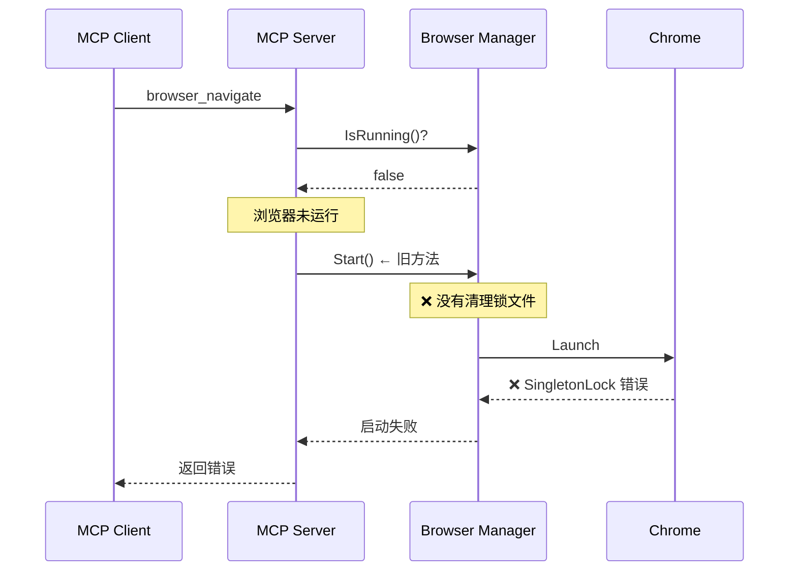
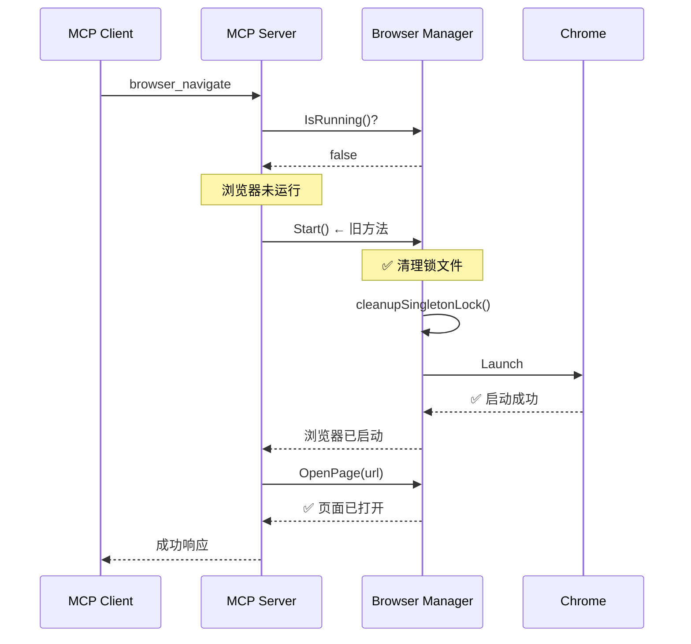

# MCP Navigate SingletonLock 错误修复

## 问题描述

用户报告通过 MCP 调用 `browser_navigate` 时会遇到 SingletonLock 错误：

```json
{
  "jsonrpc": "2.0",
  "id": 18,
  "method": "tools/call",
  "params": {
    "name": "browser_navigate",
    "arguments": {
      "url": "https://leileiluoluo.com"
    }
  }
}
```

错误响应：
```
Failed to create SingletonLock: File exists
Failed to create a ProcessSingleton for your profile directory
```

**但是：**
- 在浏览器管理页面**手动启动**浏览器后，就可以正常打开页面
- 说明问题出在 MCP 自动启动浏览器的流程中

## 根本原因

### 两条启动路径

BrowserWing 有两种启动浏览器的方式：

#### 1. 新的实例管理方式（手动启动）

```
用户点击"启动实例"
  ↓
StartInstance(instanceID)
  ↓
startInstanceInternal()
  ↓
✅ cleanupSingletonLock() - 清理锁文件
  ↓
launcher.Launch()
```

#### 2. 旧的启动方式（MCP 自动启动）

```
MCP 调用 browser_navigate
  ↓
检测浏览器未运行
  ↓
Start() - 旧的启动方法
  ↓
❌ 没有清理锁文件
  ↓
launcher.Launch()
  ↓
❌ SingletonLock 错误
```

### 代码层面的差异

**新的实例启动方式（有清理）：**
```go
// startInstanceInternal() - 第 1594 行
if instance.UserDataDir != "" {
    os.MkdirAll(instance.UserDataDir, 0o755)
    
    // ✅ 清理锁文件
    logger.Info(ctx, "Checking and cleaning up lock files before launch...")
    m.cleanupSingletonLock(ctx, instance.UserDataDir)
    
    l = l.UserDataDir(instance.UserDataDir)
}
```

**旧的启动方式（修复前没有清理）：**
```go
// Start() - 第 239 行
if m.config.Browser != nil && m.config.Browser.UserDataDir != "" {
    os.MkdirAll(userDataDir, 0o755)
    
    // ❌ 修复前：没有清理锁文件
    
    l = l.UserDataDir(userDataDir)
}
```

### MCP 调用流程



## 实施的修复

### 1. 在旧的 Start() 方法中添加清理逻辑

```go
// Start() 方法 - 第 239-265 行
if m.config.Browser != nil && m.config.Browser.UserDataDir != "" {
    userDataDir := m.config.Browser.UserDataDir
    
    if err := os.MkdirAll(userDataDir, 0o755); err != nil {
        logger.Warn(ctx, "Failed to create user data directory: %v", err)
    } else {
        // 检查目录可写性
        testFile := userDataDir + "/.test"
        if err := os.WriteFile(testFile, []byte("test"), 0o644); err != nil {
            logger.Warn(ctx, "Directory not writable: %v", err)
        } else {
            os.Remove(testFile)
            
            // ✅ 新增：清理可能存在的锁文件
            logger.Info(ctx, "Checking and cleaning up lock files before launch...")
            if err := m.cleanupSingletonLock(ctx, userDataDir); err != nil {
                logger.Warn(ctx, "Failed to cleanup singleton lock: %v", err)
            }
            
            l = l.UserDataDir(userDataDir)
            logger.Info(ctx, "✓ Using user data directory: %s", userDataDir)
        }
    }
}
```

### 2. 添加启动失败时的智能处理

```go
// Start() 方法 - 启动失败处理
url, err = l.Launch()
if err != nil {
    errMsg := err.Error()
    logger.Error(ctx, "Failed to start browser, detailed error: %v", err)
    
    // ✅ 新增：检测 SingletonLock 错误并自动清理
    if m.config.Browser != nil && 
       m.config.Browser.UserDataDir != "" && 
       strings.Contains(errMsg, "SingletonLock") {
        logger.Error(ctx, "Browser launch failed due to SingletonLock, attempting cleanup...")
        m.cleanupSingletonLock(ctx, m.config.Browser.UserDataDir)
        return fmt.Errorf("failed to launch browser (SingletonLock issue): %w\nTip: The lock files have been cleaned up. Please try starting the browser again", err)
    }
    
    // ... 其他错误处理
}
```

## 修复后的 MCP 流程



## 两种启动方式的统一

现在两种启动方式都有完整的清理逻辑：

| 启动方式 | 使用场景 | 清理时机 | 状态 |
|---------|---------|---------|------|
| **Start()** | MCP 自动启动<br>旧版 API | 启动前<br>启动失败 | ✅ 已修复 |
| **StartInstance()** | 手动启动实例<br>新版多实例 | 启动前<br>启动失败<br>停止后 | ✅ 已完善 |

## 测试验证

### 场景 1: MCP 首次调用

```bash
# 确保浏览器未运行
curl http://localhost:8080/api/browser/status
# → is_running: false

# MCP 调用 navigate
curl -X POST http://localhost:8080/api/v1/mcp/message \
  -H "Content-Type: application/json" \
  -d '{
    "jsonrpc": "2.0",
    "id": 1,
    "method": "tools/call",
    "params": {
      "name": "browser_navigate",
      "arguments": {"url": "https://example.com"}
    }
  }'

# 预期：
# ✅ 自动启动浏览器（清理锁文件）
# ✅ 成功导航到页面
```

### 场景 2: 锁文件遗留

```bash
# 模拟锁文件遗留
touch /path/to/user-data-dir/SingletonLock

# MCP 调用 navigate
curl -X POST http://localhost:8080/api/v1/mcp/message \
  -d '{"jsonrpc":"2.0","id":1,"method":"tools/call","params":{"name":"browser_navigate","arguments":{"url":"https://example.com"}}}'

# 预期：
# [INFO] Checking and cleaning up lock files before launch...
# [INFO] Cleaned up lock files: [SingletonLock]
# ✅ 成功启动并导航
```

### 场景 3: 严重锁文件冲突

```bash
# 创建锁文件并设置不可删除权限（模拟极端情况）
sudo touch /path/to/user-data-dir/SingletonLock
sudo chown root:root /path/to/user-data-dir/SingletonLock

# MCP 调用 navigate
curl -X POST http://localhost:8080/api/v1/mcp/message \
  -d '{"jsonrpc":"2.0","id":1,"method":"tools/call","params":{"name":"browser_navigate","arguments":{"url":"https://example.com"}}}'

# 预期：
# [WARN] Failed to remove lock file SingletonLock after 3 attempts: permission denied
# [ERROR] Browser launch failed due to SingletonLock, attempting cleanup...
# ❌ 返回错误，提示用户手动清理
```

## 日志输出对比

### 修复前（失败）

```
[INFO] Starting browser...
[INFO] Starting browser process...
[ERROR] Failed to start browser, detailed error: [launcher] Failed to get the debug url: 
        [3960:41432978:0125/143104.900774:ERROR:chrome/browser/process_singleton_posix.cc:345] 
        Failed to create /Users/chicken/code/browserwing_test/chrome_user_data/SingletonLock: File exists
[MCP] Error: failed to start browser: ...
```

### 修复后（成功）

```
[INFO] Starting browser...
[INFO] Checking and cleaning up lock files before launch...
[INFO] Cleaned up lock files: [SingletonLock SingletonSocket]
[INFO] ✓ Using user data directory: /Users/chicken/code/browserwing_test/chrome_user_data
[INFO] Starting browser process...
[INFO] ✓ Browser started with PID: 12345
[MCP] Success: navigated to https://example.com
```

## 为什么会有两种启动方式？

### 历史原因

1. **Start()** - 旧版单实例模式
   - 最初的实现
   - 简单直接
   - 不支持多实例

2. **StartInstance()** - 新版多实例模式
   - 后来添加的
   - 支持多个浏览器实例
   - 更完善的管理

### 为什么不统一？

**向后兼容性考虑：**
- MCP 和 Executor 仍在使用 `Start()`
- 部分旧的 API 调用 `Start()`
- 重构需要大量测试

**未来计划：**
- 逐步迁移到新的实例管理方式
- 但保持旧 API 的兼容性

## 故障排除

### 问题：修复后仍然遇到 SingletonLock

**可能原因：**
1. Chrome 进程仍在后台运行
2. 配置文件中的 user_data_dir 路径问题
3. 权限问题

**解决步骤：**
```bash
# 1. 检查 Chrome 进程
ps aux | grep chrome | grep user-data-dir

# 2. 杀死所有 Chrome 进程
pkill -9 -f "chrome.*user-data-dir"

# 3. 手动清理锁文件
rm -f /path/to/user-data-dir/Singleton*

# 4. 检查配置
cat config.toml | grep user_data_dir

# 5. 重启 BrowserWing
./browserwing --port 8080

# 6. 重试 MCP 调用
```

### 问题：清理日志未出现

**检查点：**
- 确认 config.toml 中配置了 user_data_dir
- 检查日志级别是否足够详细
- 确认使用的是修复后的版本

## 相关文档

- [SingletonLock 清理增强](./SINGLETON_LOCK_CLEANUP_ENHANCEMENT.md)
- [Chrome SingletonLock 修复](./CHROME_SINGLETON_LOCK_FIX.md)
- [MCP 集成文档](./MCP_INTEGRATION.md)
- [自动启动 Default 实例](./AUTO_START_DEFAULT_INSTANCE.md)

## 修改的文件

```
backend/services/browser/manager.go
- Start() 方法 - 添加启动前清理逻辑
- Start() 方法 - 添加启动失败时的 SingletonLock 检测和处理
```

## 总结

这次修复确保了 **MCP 自动启动浏览器** 和 **手动启动实例** 两种方式都能正确清理 SingletonLock 文件：

✅ **Start() 方法** - 启动前清理 + 失败时智能处理  
✅ **StartInstance() 方法** - 启动前清理 + 停止后清理 + 失败时智能处理  

现在无论通过哪种方式启动浏览器，都不会再遇到 SingletonLock 问题！🎉
