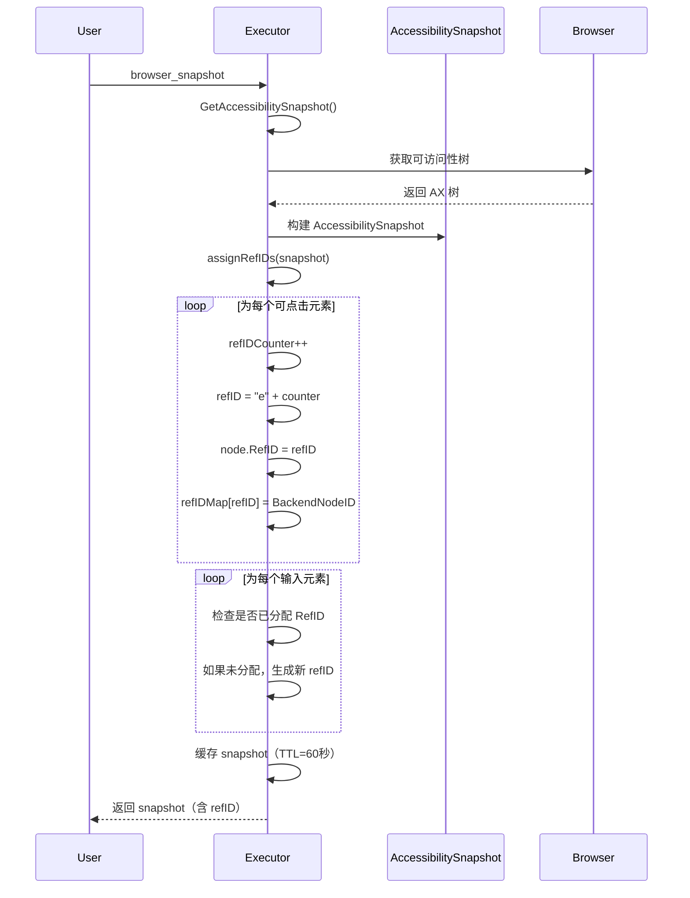

# RefID 元素引用实现文档

## 概述

RefID 是一种稳定的元素引用机制，类似于 Playwright MCP 和 Vercel agent-browser 的实现。通过为每个可交互元素分配一个简短的引用 ID（如 `e1`, `e2`, `e3`），解决了基于索引的元素查找不稳定的问题。

## 实现原理

### 1. RefID 格式

采用简洁的格式：`e1`, `e2`, `e3`, `e4`...

- **e** 表示 element（元素）
- **数字** 表示元素的序号

### 2. 核心组件

#### Executor 结构扩展

```go
type Executor struct {
    Browser *browser.Manager
    ctx     context.Context
    
    // RefID 缓存
    refIDMutex     sync.RWMutex
    refIDMap       map[string]proto.DOMBackendNodeID  // refID -> BackendNodeID
    refIDCounter   int
    refIDSnapshot  *AccessibilitySnapshot
    refIDTimestamp time.Time
    refIDTTL       time.Duration  // 默认 60 秒
}
```

#### AccessibilityNode 扩展

```go
type AccessibilityNode struct {
    // ... 其他字段 ...
    RefID string  // 引用 ID（如 e1, e2, e3...）
    // ... 其他字段 ...
}
```

### 3. RefID 生成流程



### 4. 元素查找流程

```mermaid
flowchart TD
    A[browser_click identifier] --> B{identifier 类型?}
    
    B -->|@e1 或 e1| C[RefID 查找]
    B -->|Clickable Element N| D[索引查找]
    B -->|其他| E[CSS/XPath]
    
    C --> F[从 refIDMap 查找 BackendNodeID]
    F --> G{找到?}
    G -->|是| H[通过 BackendNodeID 解析元素]
    G -->|否| I[返回错误]
    
    H --> J{是 Text 节点?}
    J -->|是| K[获取父元素]
    J -->|否| L[直接返回元素]
    
    K --> L
    L --> M[✅ 成功]
    
    D --> N[重新获取 snapshot]
    N --> O[通过索引查找]
    O --> P{元素存在?}
    P -->|是| M
    P -->|否| Q[❌ 超时]
    
    E --> R[常规 DOM 查找]
    R --> M
```

## 使用方式

### 1. 获取快照（含 RefID）

**MCP 请求：**
```json
{
  "method": "tools/call",
  "params": {
    "name": "browser_snapshot",
    "arguments": {}
  }
}
```

**响应示例：**
```
Page Interactive Elements:
(Use the ref like '@e1' or index like 'Clickable Element [1]' to interact with elements)

Clickable Elements:
  @e1 [1] 读书 (role: link)
  @e2 [2] 计算机 (role: link)
  @e3 [3] 观影 (role: link)
  @e4 [4] 练字 (role: link)
  @e5 [5] Markdown 将成为 AI 时代的通用编程语言？ (role: link)
  @e6 [6] 使用 FastMCP 编写一个 MySQL MCP Server (role: link)
  ...

Input Elements:
  @e50 [1] 搜索 (role: textbox) [placeholder: 输入关键词搜索]
  ...
```

### 2. 使用 RefID 操作元素

#### 方式 1：使用 RefID（推荐）

```json
{
  "method": "tools/call",
  "params": {
    "name": "browser_click",
    "arguments": {
      "identifier": "@e1"  // ✅ 使用 @e1
    }
  }
}
```

或不带 @ 符号：

```json
{
  "arguments": {
    "identifier": "e1"  // ✅ 也支持
  }
}
```

#### 方式 2：使用索引（兼容）

```json
{
  "arguments": {
    "identifier": "Clickable Element [1]"  // ✅ 仍然支持
  }
}
```

### 3. 输入文本

```json
{
  "method": "tools/call",
  "params": {
    "name": "browser_type",
    "arguments": {
      "identifier": "@e50",
      "text": "hello world"
    }
  }
}
```

## 优势对比

| 特性 | 索引方式 | RefID 方式 |
|------|---------|-----------|
| **稳定性** | ❌ 页面变化时索引会变 | ✅ RefID 直接映射到 DOM 节点 |
| **性能** | ❌ 每次重新遍历树 | ✅ 直接通过 BackendNodeID 定位 |
| **缓存** | ❌ 不缓存 | ✅ 60秒缓存（可配置）|
| **动态页面** | ❌ 易失败 | ✅ 高可靠性 |
| **时间容忍** | ❌ 间隔越久越易失败 | ✅ 60秒内稳定 |

## 示例场景

### 场景 1：动态内容加载

**问题：** 页面有懒加载内容，索引方式会失败

```javascript
// 页面在 500ms 后插入新元素
setTimeout(() => {
  document.body.insertBefore(newElement, targetElement);
}, 500);
```

**索引方式（失败）：**
```
T0: snapshot → [1] Header, [2] Content, [3] Footer
T1: 用户选择 [3] Footer
T2: 页面加载新元素
T3: click([3]) 
    → 重新 snapshot 
    → [1] Header, [2] Content, [2.5] NewElement, [3] Footer
    ❌ [3] 现在指向 NewElement，不是原来的 Footer！
```

**RefID 方式（成功）：**
```
T0: snapshot → @e3 Footer (BackendNodeID: 12345)
T1: 用户选择 @e3
T2: 页面加载新元素
T3: click("@e3")
    → 直接通过 BackendNodeID 12345 定位
    ✅ 正确点击 Footer
```

### 场景 2：列表操作

**问题：** 删除列表项后，索引会错位

**索引方式（失败）：**
```
T0: snapshot → [1] Item 1, [2] Item 2, [3] Item 3
T1: 用户想点击 Item 2，选择 [2]
T2: 其他操作删除了 Item 1
T3: click([2])
    → 重新 snapshot
    → [1] Item 2, [2] Item 3
    ❌ [2] 现在是 Item 3！
```

**RefID 方式（成功）：**
```
T0: snapshot → @e2 Item 2 (BackendNodeID: 67890)
T1: 用户选择 @e2
T2: 删除 Item 1
T3: click("@e2")
    → 直接定位 BackendNodeID 67890
    ✅ 正确点击 Item 2
```

## 缓存机制

### 缓存策略

- **TTL（默认）：** 60 秒
- **自动失效：** 获取新快照时自动刷新
- **手动失效：** 调用 `InvalidateRefIDCache()`

### 缓存流程

```go
func (e *Executor) GetAccessibilitySnapshot(ctx context.Context) (*AccessibilitySnapshot, error) {
    // 1. 检查缓存
    if e.refIDSnapshot != nil && time.Since(e.refIDTimestamp) < e.refIDTTL {
        return e.refIDSnapshot, nil  // ✅ 返回缓存
    }
    
    // 2. 获取新快照
    snapshot, err := GetAccessibilitySnapshot(ctx, page)
    
    // 3. 生成 RefID 并缓存
    e.assignRefIDs(snapshot)
    e.refIDSnapshot = snapshot
    e.refIDTimestamp = time.Now()
    
    return snapshot, nil
}
```

### 缓存失效时机

1. ✅ **自动失效**：TTL 过期（60秒）
2. ✅ **手动失效**：调用 `InvalidateRefIDCache()`
3. ✅ **导航失效**：`Navigate()` 会触发 `GetAccessibilitySnapshot()`，自动刷新
4. ✅ **页面刷新**：重新获取快照会刷新 RefID

## 查找优先级

`findElementWithTimeout` 的查找顺序：

1. **RefID 查找**（最高优先级）
   - `@e1`, `@e2` 或 `e1`, `e2`
   - 直接通过 BackendNodeID 定位

2. **索引查找**
   - `Clickable Element [N]`
   - `Input Element [N]`
   - 重新获取快照并查找

3. **CSS 选择器**
   - `#id`, `.class`, `button[type="submit"]`

4. **XPath**
   - `//div[@class="container"]`

5. **其他匹配**
   - 通过标签、占位符等

## 错误处理

### RefID 不存在

```go
refIDMap := map[string]BackendNodeID{
    "e1": 12345,
    "e2": 67890,
}

elem, err := findElementByRefID(ctx, page, "e99")
// err: refID not found: e99
```

### BackendNodeID 无效

```go
// 元素已被删除
elem, err := findElementByRefID(ctx, page, "e1")
// err: failed to resolve node e1: node not found
```

### Text 节点自动处理

```go
// RefID 指向 Text 节点，自动获取父元素
elem, err := findElementByRefID(ctx, page, "e1")
// [INFO] RefID e1 points to Text node, getting parent
// ✅ 返回父 Element 节点
```

## 性能考虑

### 内存使用

- **RefID 映射**：约 50 字节 / 元素
- **100 个元素**：约 5KB
- **1000 个元素**：约 50KB

### 查找时间

| 方法 | 平均时间 | 说明 |
|------|---------|------|
| RefID | ~2ms | 直接 map 查找 + DOM 解析 |
| 索引 | ~50-200ms | 遍历树 + 多次匹配 |
| CSS | ~5-20ms | 浏览器原生查找 |

## 向后兼容性

### API 兼容性

- ✅ 完全向后兼容旧的索引格式
- ✅ 渐进增强，客户端可选择使用 RefID
- ✅ 自动降级，RefID 失败时尝试其他方式

### 版本策略

```
v1.0: 仅支持索引
v2.0: 同时支持 RefID 和索引（当前版本）
      - "Clickable Element [11]" ✅
      - "@e1" 或 "e1" ✅
v3.0: 推荐使用 RefID（未来）
v4.0: 可选仅支持 RefID（可选未来）
```

## 测试示例

### 测试 1：基本 RefID 查找

```bash
# 1. 导航到页面
curl -X POST .../browser_navigate -d '{"url": "https://example.com"}'

# 2. 获取快照
curl -X POST .../browser_snapshot

# 响应：
# @e1 [1] 首页 (role: link)
# @e2 [2] 关于 (role: link)

# 3. 使用 RefID 点击
curl -X POST .../browser_click -d '{"identifier": "@e1"}'

# 预期：✅ 成功点击"首页"链接
```

### 测试 2：缓存有效性

```bash
# 1. 获取快照（生成 RefID）
curl -X POST .../browser_snapshot
# @e1 [1] 按钮 A

# 2. 立即使用 RefID（缓存命中）
curl -X POST .../browser_click -d '{"identifier": "@e1"}'
# 预期：✅ 快速成功（~2ms）

# 3. 60秒后再次使用
sleep 61
curl -X POST .../browser_click -d '{"identifier": "@e1"}'
# 预期：⚠️ 缓存过期，需要重新获取 snapshot
# 如果页面未变化，仍然成功
```

### 测试 3：动态页面

```bash
# 1. 打开动态页面
curl -X POST .../browser_navigate -d '{"url": "https://dynamic-site.com"}'

# 2. 获取快照
curl -X POST .../browser_snapshot
# @e5 [5] 动态按钮

# 3. 页面加载更多内容（AJAX）
# （页面自动加载，索引会变化）

# 4. 使用 RefID 点击
curl -X POST .../browser_click -d '{"identifier": "@e5"}'
# 预期：✅ 成功（RefID 不受影响）

# 5. 使用索引点击（对比）
curl -X POST .../browser_click -d '{"identifier": "Clickable Element [5]"}'
# 预期：❌ 可能失败（索引已变化）
```

## 配置选项

### 调整 RefID TTL

```go
executor := NewExecutor(browserManager)
executor.refIDTTL = 120 * time.Second  // 设置为 120 秒
```

### 手动失效缓存

```go
// 在页面发生重大变化后
executor.InvalidateRefIDCache()
```

## 监控指标

建议跟踪以下指标：

```go
type RefIDMetrics struct {
    RefIDHits      int64  // RefID 成功定位次数
    RefIDMisses    int64  // RefID 失败次数
    CacheHits      int64  // 缓存命中次数
    CacheMisses    int64  // 缓存未命中次数
    AvgLookupTime  time.Duration
}
```

## 相关文档

- [RefID 元素引用改进方案](./REFID_ELEMENT_REFERENCE_PROPOSAL.md) - 设计文档
- [Text 节点点击修复](./TEXT_NODE_CLICK_FIX.md) - Text 节点处理
- [MCP 集成文档](./MCP_INTEGRATION.md) - MCP 工具使用

## 故障排除

### 问题 1：RefID 找不到元素

**症状：** `refID not found: e99`

**原因：**
- RefID 缓存已失效
- 使用了其他 snapshot 的 refID

**解决：**
```bash
# 1. 重新获取 snapshot
curl -X POST .../browser_snapshot

# 2. 使用新的 refID
```

### 问题 2：RefID 指向错误元素

**症状：** 点击了错误的元素

**原因：**
- 缓存过期但未刷新
- 页面结构发生重大变化

**解决：**
```bash
# 手动失效缓存并重新获取
# 或等待 TTL 过期（60秒）
```

### 问题 3：性能问题

**症状：** RefID 查找很慢

**原因：**
- 网络延迟
- 元素已被删除，需要多次重试

**解决：**
```bash
# 检查元素是否存在
# 考虑增加 TTL 时间
```

## 总结

RefID 实现通过以下机制提供了稳定可靠的元素引用：

✅ **简洁的格式**：e1, e2, e3...  
✅ **稳定的映射**：RefID → BackendNodeID  
✅ **智能缓存**：60秒 TTL，自动刷新  
✅ **向后兼容**：保留索引格式支持  
✅ **自动降级**：RefID 失败时尝试其他方式  
✅ **Text 节点处理**：自动获取父元素  

这大幅提升了 MCP 交互的稳定性和可靠性，特别是在动态页面场景下！🚀
