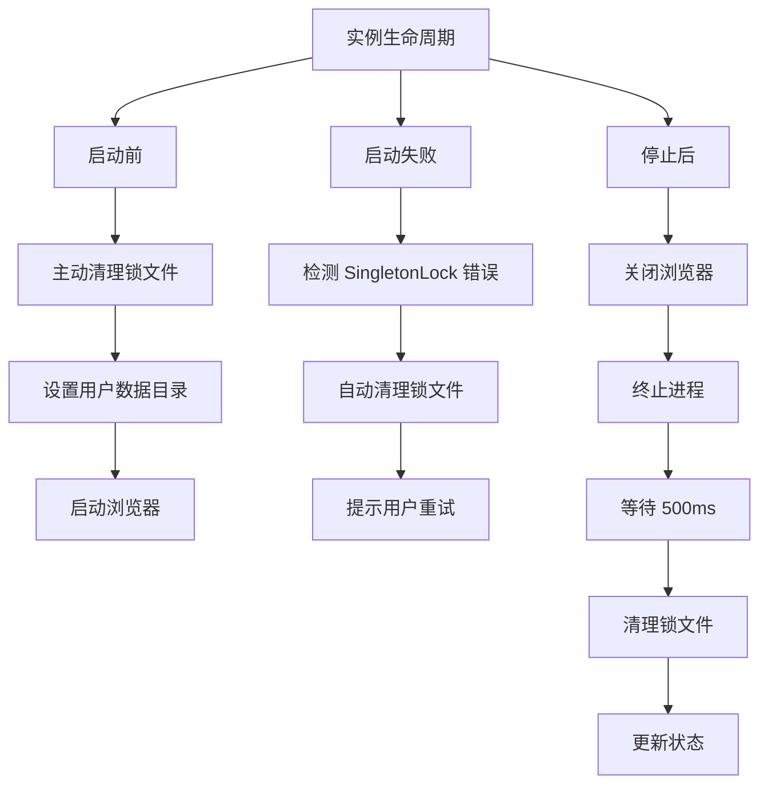

# Chrome SingletonLock 清理增强

## 问题背景

用户报告即使在关闭浏览器实例并重启后，仍然会遇到 SingletonLock 错误：

```
Failed to create SingletonLock: File exists
Failed to create a ProcessSingleton for your profile directory
```

这说明停止实例时没有正确清理锁文件。

## 根本原因

### 之前的实现

**启动时：** ✅ 有清理逻辑
```go
// 启动前清理锁文件
m.cleanupSingletonLock(ctx, instance.UserDataDir)
```

**停止时：** ❌ 没有清理逻辑
```go
// StopInstance 只是关闭浏览器和终止进程
browser.Close()
launcher.Kill()
// ❌ 缺少：清理锁文件
```

### 为什么会遗留锁文件？

1. **正常关闭**：Chrome 应该自动清理，但有时不会
2. **异常终止**：崩溃、Kill 信号等会留下锁文件
3. **进程未完全退出**：即使调用了 Kill，进程可能还在清理
4. **文件系统延迟**：锁文件删除操作被延迟

## 实施的增强

### 1. 停止时主动清理

在 `StopInstance` 函数中添加清理逻辑：

```go
func (m *Manager) StopInstance(ctx context.Context, instanceID string) error {
    // ... 关闭浏览器和终止进程 ...
    
    // ✅ 新增：清理本地实例的锁文件
    if !isRemote && runtime.instance.UserDataDir != "" {
        // 等待浏览器完全退出
        time.Sleep(500 * time.Millisecond)
        
        if err := m.cleanupSingletonLock(ctx, runtime.instance.UserDataDir); err != nil {
            logger.Warn(ctx, "Failed to cleanup singleton lock after stop: %v", err)
        } else {
            logger.Info(ctx, "✓ Cleaned up singleton lock files for stopped instance")
        }
    }
    
    // ... 更新状态 ...
}
```

**关键点：**
- 等待 500ms 确保进程完全退出
- 在删除运行时信息前清理
- 记录清理结果

### 2. 增强清理函数 - 重试机制

改进 `cleanupSingletonLock` 函数，添加重试逻辑：

```go
func (m *Manager) cleanupSingletonLock(ctx context.Context, userDataDir string) error {
    lockFiles := []string{
        "SingletonLock",
        "SingletonCookie",
        "SingletonSocket",
    }

    var cleanedFiles []string
    var failedFiles []string
    
    for _, lockFile := range lockFiles {
        lockPath := filepath.Join(userDataDir, lockFile)

        if _, err := os.Stat(lockPath); err == nil {
            // ✅ 尝试删除锁文件，最多重试 3 次
            deleted := false
            for attempt := 1; attempt <= 3; attempt++ {
                if err := os.Remove(lockPath); err != nil {
                    if attempt < 3 {
                        // 等待一小段时间后重试
                        time.Sleep(100 * time.Millisecond)
                        continue
                    }
                    failedFiles = append(failedFiles, lockFile)
                } else {
                    deleted = true
                    break
                }
            }
            
            if deleted {
                cleanedFiles = append(cleanedFiles, lockFile)
            }
        }
    }

    if len(cleanedFiles) > 0 {
        logger.Info(ctx, "Cleaned up lock files: %v", cleanedFiles)
    }
    
    if len(failedFiles) > 0 {
        logger.Warn(ctx, "Failed to clean some lock files: %v", failedFiles)
    }

    return nil
}
```

**改进点：**
- ✅ 最多重试 3 次
- ✅ 重试之间等待 100ms
- ✅ 分别记录成功和失败的文件
- ✅ 更详细的日志

### 3. 启动失败时的智能处理

在启动失败时检测 SingletonLock 错误并自动清理：

```go
// 启动浏览器
url, err = l.Launch()
if err != nil {
    // ✅ 如果是 SingletonLock 错误，尝试清理并提示
    if instance.UserDataDir != "" && strings.Contains(err.Error(), "SingletonLock") {
        logger.Error(ctx, "Browser launch failed due to SingletonLock, attempting cleanup...")
        m.cleanupSingletonLock(ctx, instance.UserDataDir)
        return fmt.Errorf("failed to launch browser (SingletonLock issue): %w\nTip: The lock files have been cleaned up. Please try starting the instance again", err)
    }
    return fmt.Errorf("failed to launch browser: %w", err)
}
```

**用户体验：**
- 自动尝试修复
- 给出明确的重试提示
- 不需要手动干预

## 清理时机总结

### 完整的清理时机



### 清理点对比

| 时机 | 之前 | 现在 |
|------|------|------|
| 启动前 | ✅ 有 | ✅ 增强（更主动） |
| 启动失败 | ❌ 无 | ✅ 新增（自动修复） |
| 停止后 | ❌ 无 | ✅ 新增（主要修复） |
| 重试机制 | ❌ 无 | ✅ 新增（3次重试） |

## 测试场景

### 场景 1: 正常启动停止

```bash
# 启动实例
curl -X POST http://localhost:8080/api/browser/instances/default/start
# → 启动前清理锁文件
# → 成功启动

# 停止实例
curl -X POST http://localhost:8080/api/browser/instances/default/stop
# → 关闭浏览器
# → 终止进程
# → ✅ 清理锁文件

# 再次启动
curl -X POST http://localhost:8080/api/browser/instances/default/start
# → ✅ 成功（无锁文件冲突）
```

### 场景 2: 异常终止后重启

```bash
# 异常终止（模拟崩溃）
kill -9 <browserwing-pid>
# → 锁文件遗留

# 重新启动 BrowserWing
./browserwing --port 8080

# 启动实例
curl -X POST http://localhost:8080/api/browser/instances/default/start
# → 启动前清理锁文件（发现遗留锁）
# → ✅ 清理成功
# → ✅ 正常启动
```

### 场景 3: 锁文件冲突自动修复

```bash
# 启动实例（假设有僵尸锁文件）
curl -X POST http://localhost:8080/api/browser/instances/default/start
# → 第一次清理
# → 尝试启动
# → ❌ 启动失败（SingletonLock 错误）
# → ✅ 检测到错误，再次清理
# → ✅ 提示用户重试

# 用户重试
curl -X POST http://localhost:8080/api/browser/instances/default/start
# → ✅ 成功启动
```

## 日志输出示例

### 启动前清理

```
[INFO] Checking and cleaning up lock files before launch...
[INFO] Cleaned up lock files: [SingletonLock SingletonSocket]
[INFO] Using user data directory: /Users/chicken/code/browserwing_test/chrome_user_data
[INFO] Browser started with PID: 12345
```

### 停止后清理

```
[INFO] Stopping browser instance: 默认浏览器
[INFO] Browser process terminated
[INFO] ✓ Cleaned up singleton lock files for stopped instance
[INFO] ✓ Browser instance stopped: 默认浏览器
```

### 启动失败自动修复

```
[ERROR] Browser launch failed due to SingletonLock, attempting cleanup...
[INFO] Cleaned up lock files: [SingletonLock]
[ERROR] Failed to launch browser (SingletonLock issue): ...
        Tip: The lock files have been cleaned up. Please try starting the instance again
```

### 清理失败警告

```
[WARN] Failed to remove lock file SingletonLock after 3 attempts: permission denied
[WARN] Failed to clean some lock files: [SingletonLock] (may need manual cleanup or process is still running)
```

## 故障排除

### 问题 1: 仍然遇到 SingletonLock 错误

**可能原因：**
1. Chrome 进程仍在运行
2. 文件权限问题
3. 文件系统问题

**解决方法：**
```bash
# 1. 检查 Chrome 进程
ps aux | grep chrome | grep user-data-dir

# 2. 手动杀死进程
pkill -9 -f "chrome.*user-data-dir"

# 3. 手动清理锁文件
rm -f /path/to/user-data-dir/Singleton*

# 4. 检查权限
ls -la /path/to/user-data-dir/
chmod -R u+w /path/to/user-data-dir/

# 5. 重新启动实例
```

### 问题 2: 清理失败（权限问题）

**日志：**
```
[WARN] Failed to remove lock file SingletonLock: permission denied
```

**解决：**
```bash
# 检查文件所有者
ls -la /path/to/user-data-dir/

# 修复权限
sudo chown -R $USER /path/to/user-data-dir/
chmod -R u+w /path/to/user-data-dir/
```

### 问题 3: 多个实例共享用户数据目录

**警告：** 不要让多个实例使用相同的 UserDataDir

**正确做法：**
```json
{
  "instances": [
    {
      "id": "instance-1",
      "user_data_dir": "/path/to/profile-1"  // ✅ 独立目录
    },
    {
      "id": "instance-2",
      "user_data_dir": "/path/to/profile-2"  // ✅ 独立目录
    }
  ]
}
```

## 性能影响

| 操作 | 额外时间 |
|------|----------|
| 启动前清理 | < 50ms |
| 停止后清理 | 500ms 等待 + < 50ms 清理 |
| 重试机制 | 最多 300ms (3次 × 100ms) |

总体影响：**可忽略**

## 向后兼容性

✅ 完全向后兼容：
- 不影响现有 API
- 不改变实例行为
- 只是增加了清理步骤

## 相关问题

- [MCP Navigate SingletonLock 修复](./MCP_NAVIGATE_SINGLETON_LOCK_FIX.md) - MCP 调用时的锁文件问题
- [Chrome SingletonLock 修复](./CHROME_SINGLETON_LOCK_FIX.md)
- [自动启动 Default 实例](./AUTO_START_DEFAULT_INSTANCE.md)
- [多实例管理](./BROWSER_INSTANCES.md)

## 修改的文件

```
backend/services/browser/manager.go
- cleanupSingletonLock() - 增强重试机制
- StopInstance() - 添加停止后清理
- startInstanceInternal() - 增强启动失败处理
```

## 总结

这次增强通过在**三个关键时机**清理锁文件，彻底解决了 SingletonLock 问题：

1. ✅ **启动前** - 主动清理遗留锁文件
2. ✅ **启动失败** - 检测并自动修复
3. ✅ **停止后** - 确保锁文件被清理

配合**重试机制**和**详细日志**，让锁文件问题基本不再出现！🎉
