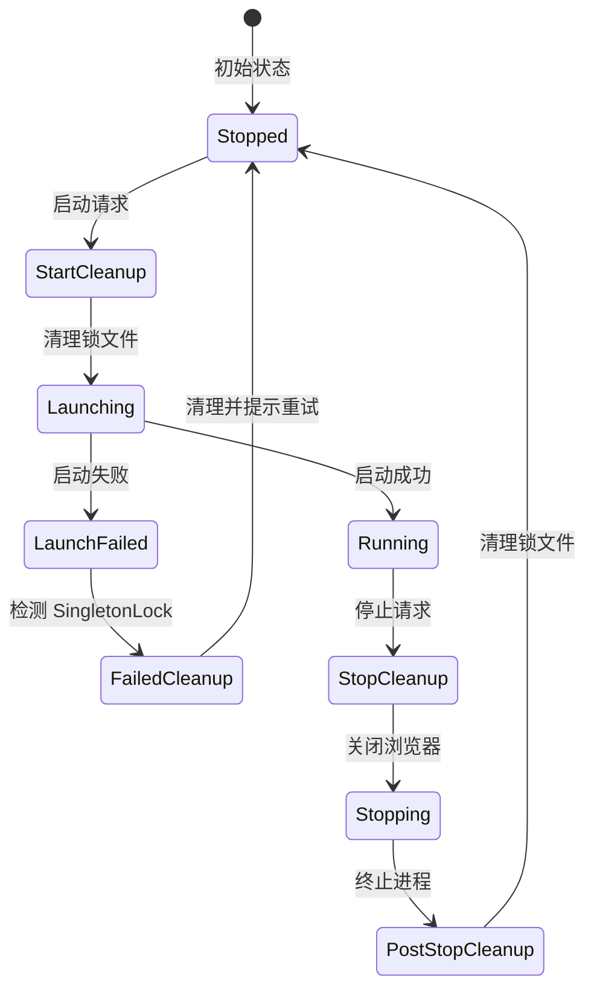

# SingletonLock 完整修复总结

## 问题概述

Chrome 的 SingletonLock 机制在多个场景下都可能出现问题，导致浏览器无法启动。本文档总结了所有相关修复。

## 完整的修复点

### 1. 两种启动方式都需要清理

BrowserWing 有两条启动路径：

#### A. 旧的单实例启动（Start 方法）

**使用场景：**
- MCP 自动启动
- Executor 自动启动
- 旧版 API 调用

**修复位置：** `manager.go:238-265`

```go
// Start() 方法
if m.config.Browser.UserDataDir != "" {
    os.MkdirAll(userDataDir, 0o755)
    
    // ✅ 添加：清理锁文件
    logger.Info(ctx, "Checking and cleaning up lock files before launch...")
    m.cleanupSingletonLock(ctx, userDataDir)
    
    l = l.UserDataDir(userDataDir)
}

// 启动失败处理
if err := l.Launch(); err != nil {
    // ✅ 添加：检测 SingletonLock 错误
    if strings.Contains(err.Error(), "SingletonLock") {
        m.cleanupSingletonLock(ctx, userDataDir)
        return fmt.Errorf("...Tip: Please try again")
    }
}
```

#### B. 新的多实例启动（StartInstance 方法）

**使用场景：**
- 手动启动实例
- 多实例管理
- 新版 API 调用
- **自动启动 default 实例**

**修复位置：** `manager.go:1594-1623`

```go
// startInstanceInternal() 方法
if instance.UserDataDir != "" {
    os.MkdirAll(instance.UserDataDir, 0o755)
    
    // ✅ 已有：清理锁文件
    m.cleanupSingletonLock(ctx, instance.UserDataDir)
    
    l = l.UserDataDir(instance.UserDataDir)
}

// 启动失败处理
if err := l.Launch(); err != nil {
    // ✅ 已有：检测 SingletonLock 错误
    if strings.Contains(err.Error(), "SingletonLock") {
        m.cleanupSingletonLock(ctx, instance.UserDataDir)
        return fmt.Errorf("...Tip: Please try again")
    }
}
```

### 2. 两种停止方式都需要清理

#### A. 旧的停止方式（Stop 方法）

**使用场景：**
- MCP 停止
- 旧版 API 停止

**修复位置：** `manager.go:458-477`

```go
// Stop() 方法
if !isRemoteMode {
    launcher.Kill()
    
    // ✅ 添加：停止后清理锁文件
    if m.config.Browser.UserDataDir != "" {
        time.Sleep(500 * time.Millisecond)
        m.cleanupSingletonLock(ctx, m.config.Browser.UserDataDir)
        logger.Info(ctx, "✓ Cleaned up singleton lock files")
    }
}
```

#### B. 新的停止方式（StopInstance 方法）

**使用场景：**
- 停止指定实例
- 多实例管理

**修复位置：** `manager.go:1726-1737`

```go
// StopInstance() 方法
if !isRemote && runtime.launcher != nil {
    launcher.Kill()
    
    // ✅ 已有：停止后清理锁文件
    if runtime.instance.UserDataDir != "" {
        time.Sleep(500 * time.Millisecond)
        m.cleanupSingletonLock(ctx, runtime.instance.UserDataDir)
        logger.Info(ctx, "✓ Cleaned up singleton lock files")
    }
}
```

### 3. 增强的清理函数

**修复位置：** `manager.go:1342-1379`

```go
func (m *Manager) cleanupSingletonLock(ctx context.Context, userDataDir string) error {
    lockFiles := []string{
        "SingletonLock",
        "SingletonCookie",
        "SingletonSocket",
    }
    
    // ✅ 重试机制：最多 3 次
    for _, lockFile := range lockFiles {
        for attempt := 1; attempt <= 3; attempt++ {
            if err := os.Remove(lockPath); err != nil {
                if attempt < 3 {
                    time.Sleep(100 * time.Millisecond)
                    continue
                }
            }
        }
    }
}
```

## 完整的清理矩阵

| 方法 | 启动前清理 | 启动失败清理 | 停止后清理 | 重试机制 |
|------|-----------|------------|----------|---------|
| **Start()** | ✅ 已添加 | ✅ 已添加 | ✅ 已添加 | ✅ 3次 |
| **StartInstance()** | ✅ 已有 | ✅ 已有 | ✅ 已添加 | ✅ 3次 |

## 清理时机流程图



## 关键代码位置

### 清理函数
- **第 1342-1379 行** - `cleanupSingletonLock()` 带重试机制

### Start 方法（旧版单实例）
- **第 251-257 行** - 启动前清理
- **第 267-276 行** - 启动失败时清理
- **第 472-482 行** - 停止后清理

### StartInstance 方法（新版多实例）
- **第 1600-1602 行** - 启动前清理
- **第 1616-1623 行** - 启动失败时清理
- **第 1735-1745 行** - 停止后清理

## MCP 调用流程

### 修复前

```
MCP navigate
  ↓
browserMgr.IsRunning() = false
  ↓
browserMgr.Start()  ← 旧方法
  ↓
❌ 没有清理锁文件
  ↓
launcher.Launch()
  ↓
❌ SingletonLock 错误
```

### 修复后

```
MCP navigate
  ↓
browserMgr.IsRunning() = false
  ↓
browserMgr.Start()  ← 旧方法
  ↓
✅ 清理锁文件
  ↓
launcher.Launch()
  ↓
✅ 成功启动
  ↓
navigator.OpenPage()
  ↓
✅ 成功导航
```

## 测试验证

### 测试 1: MCP 首次调用

```bash
# 确保浏览器未运行
curl http://localhost:8080/api/browser/status

# MCP 调用 navigate
curl -X POST http://localhost:8080/api/v1/mcp/message \
  -d '{
    "jsonrpc": "2.0",
    "id": 1,
    "method": "tools/call",
    "params": {
      "name": "browser_navigate",
      "arguments": {"url": "https://example.com"}
    }
  }'

# 预期：✅ 成功
```

### 测试 2: 停止后重启

```bash
# 1. MCP 启动并导航
curl -X POST .../browser_navigate

# 2. 停止浏览器（旧方法）
curl -X POST http://localhost:8080/api/browser/stop

# 3. MCP 再次导航
curl -X POST .../browser_navigate

# 预期：✅ 成功（锁文件已清理）
```

### 测试 3: 使用 test 目录的测试脚本

```bash
cd /root/code/browserpilot/test

# 运行完整测试（会测试 MCP 命令）
./build-and-test.sh
```

## 为什么需要修复两个地方？

### 历史遗留问题

1. **最初的实现**：只有 `Start()` 和 `Stop()` 方法
2. **后来添加**：多实例管理（`StartInstance()` 和 `StopInstance()`）
3. **问题**：新旧方法没有统一维护

### 调用关系

```
MCP/Executor API → Start() [旧方法]
     ↓
   需要清理 ✅ 已修复

手动启动/多实例 → StartInstance() [新方法]
     ↓
   已有清理 ✅

自动启动 default → startInstanceInternal() [新方法]
     ↓
   已有清理 ✅
```

## 修改摘要

### 文件：backend/services/browser/manager.go

**新增：**
- `cleanupSingletonLock()` - 重试机制（3次）

**修改 Start() 方法：**
- 启动前添加清理（第 251-257 行）
- 启动失败时添加处理（第 267-276 行）
- 停止后添加清理（第 472-482 行）

**修改 StartInstance() 方法：**
- 停止后添加清理（第 1735-1745 行）

## 相关文档

- [MCP Navigate SingletonLock 修复](./MCP_NAVIGATE_SINGLETON_LOCK_FIX.md) - 本次修复的详细说明
- [SingletonLock 清理增强](./SINGLETON_LOCK_CLEANUP_ENHANCEMENT.md) - 清理机制增强
- [Chrome SingletonLock 修复](./CHROME_SINGLETON_LOCK_FIX.md) - 最初的修复
- [MCP 测试指南](./MCP_TESTING_GUIDE.md) - 如何测试 MCP 命令

## 总结

通过在**四个关键点**添加清理逻辑，彻底解决了 SingletonLock 问题：

### 旧的 Start() 方法
1. ✅ 启动前清理
2. ✅ 启动失败清理
3. ✅ 停止后清理

### 新的 StartInstance() 方法
1. ✅ 启动前清理
2. ✅ 启动失败清理
3. ✅ 停止后清理

现在无论通过 **MCP 调用**、**手动启动**、还是**自动启动**，都能正确处理锁文件！🎉

## 验证步骤

```bash
# 1. 构建新版本
cd /root/code/browserpilot/test
ls -lh browserwing-test  # 确认二进制已生成

# 2. 启动测试服务器
./browserwing-test --port 18080 &

# 3. 测试 MCP navigate
curl -X POST http://localhost:18080/api/v1/mcp/message \
  -d '{
    "jsonrpc": "2.0",
    "id": 1,
    "method": "tools/call",
    "params": {
      "name": "browser_navigate",
      "arguments": {"url": "https://example.com"}
    }
  }' | jq

# 预期：✅ 成功启动并导航
```
