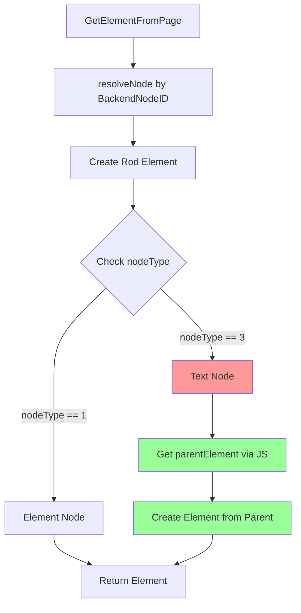

# Text 节点点击错误修复

## 问题描述

用户通过 MCP 调用 `browser_click` 时，使用可访问性索引（如 `"Clickable Element [134]"`）作为 identifier，会遇到以下错误：

```json
{
  "jsonrpc": "2.0",
  "id": 24,
  "method": "tools/call",
  "params": {
    "name": "browser_click",
    "arguments": {
      "identifier": "Clickable Element [134]"
    }
  }
}
```

**错误响应：**
```
eval js error: TypeError: Failed to execute 'getComputedStyle' on 'Window': 
parameter 1 is not of type 'Element'.
    at Text.<anonymous> (<anonymous>:1:29)
    at Text.<anonymous> (<anonymous>:1:78) <nil>
```

**关键信息：**
- 错误信息显示 `at Text.<anonymous>` - 说明操作的是 **Text 节点**而不是 Element 节点
- `getComputedStyle` 只能在 Element 节点上调用，不能在 Text 节点上调用

## 根本原因

### 可访问性树与 DOM 树的差异

1. **可访问性树（Accessibility Tree）**：
   - 由浏览器为屏幕阅读器等辅助技术生成
   - 包含 Element 节点和 Text 节点
   - Text 节点也有自己的可访问性信息

2. **DOM 树（Document Object Model）**：
   - HTML 文档的结构表示
   - Element 节点（如 `<div>`, `<button>`）
   - Text 节点（纯文本内容）

3. **问题**：
   - 当用户点击一个可访问性树中的"可点击元素"时
   - 该元素可能对应的是一个 **Text 节点**（例如按钮中的文字）
   - Text 节点不支持 `getComputedStyle`、`click` 等 DOM 操作

### 示例场景

```html
<button id="myButton">
  Click Me  <!-- 这是一个 Text 节点 -->
</button>
```

**可访问性树：**
```
- button (BackendNodeID: 123)
  - text "Click Me" (BackendNodeID: 124)  ← 可能被识别为"可点击"
```

当用户选择 "Clickable Element [134]" 时，如果它对应的是 BackendNodeID 124（Text 节点），就会出现问题。

### 调用链

```
MCP: browser_click("Clickable Element [134]")
  ↓
Executor.Click(ctx, identifier)
  ↓
findElementByAccessibilityIndex(identifier)
  ↓
GetElementFromPage(page, targetNode)
  ↓
DOM.resolveNode(BackendNodeID: 124)  ← 解析为 Text 节点
  ↓
elem.Click()  ← Rod 内部调用 getComputedStyle
  ↓
❌ TypeError: parameter 1 is not of type 'Element'
```

## 实施的修复

### 修改文件：`backend/executor/accessibility.go`

**修复位置：** `GetElementFromPage` 函数（第 648-700 行）

**修复逻辑：**

```go
// GetElementFromPage 从页面获取 Rod Element（基于 BackendNodeID）
func GetElementFromPage(ctx context.Context, page *rod.Page, node *AccessibilityNode) (*rod.Element, error) {
	// ... 原有的解析逻辑 ...
	
	// 创建 Rod Element
	elem, err := page.ElementFromObject(obj.Object)
	if err != nil {
		return nil, fmt.Errorf("failed to create element from object: %w", err)
	}

	// ✅ 新增：检查是否是 Text 节点，如果是，返回其父元素
	nodeType, err := elem.Eval(`() => this.nodeType`)
	if err == nil && nodeType != nil {
		// nodeType === 3 表示 Text 节点
		// nodeType === 1 表示 Element 节点
		if nodeType.Value.Int() == 3 {
			logger.Info(ctx, "[GetElementFromPage] Node is a Text node, getting parent element")
			
			// 使用 JavaScript 返回父元素
			parentResult, err := elem.Eval(`() => {
				return this.parentElement;
			}`)
			if err != nil {
				return nil, fmt.Errorf("text node has no parent element: %w", err)
			}
			if parentResult == nil {
				return nil, fmt.Errorf("text node parent is null")
			}
			
			// 从返回的对象创建新的 Rod Element
			parentObj := &proto.RuntimeRemoteObject{
				Type:     "object",
				Subtype:  "node",
				ObjectID: proto.RuntimeRemoteObjectID(parentResult.ObjectID),
			}
			elem, err = page.ElementFromObject(parentObj)
			if err != nil {
				return nil, fmt.Errorf("failed to create element from parent: %w", err)
			}
		}
	}

	return elem, nil
}
```

### 修复流程



### Node Type 常量

| nodeType | 类型 | 说明 |
|----------|------|------|
| 1 | ELEMENT_NODE | 元素节点（如 `<div>`, `<button>`） |
| 3 | TEXT_NODE | 文本节点（纯文本） |
| 8 | COMMENT_NODE | 注释节点 |
| 9 | DOCUMENT_NODE | Document 节点 |

## 修复前后对比

### 修复前

```
用户点击 "Clickable Element [134]"
  ↓
解析为 Text 节点 "Click Me"
  ↓
尝试 elem.Click()
  ↓
内部调用 getComputedStyle(textNode)
  ↓
❌ TypeError: parameter 1 is not of type 'Element'
```

### 修复后

```
用户点击 "Clickable Element [134]"
  ↓
解析为 Text 节点 "Click Me"
  ↓
✅ 检测到是 Text 节点 (nodeType === 3)
  ↓
获取父元素 <button>
  ↓
返回父元素
  ↓
成功执行 elem.Click()
  ↓
✅ 点击成功
```

## 日志输出

### 修复后的日志

当遇到 Text 节点时，会输出以下日志：

```
[INFO] [GetElementFromPage] Node is a Text node, getting parent element
```

这有助于调试和了解哪些可访问性节点对应的是 Text 节点。

## 测试验证

### 场景 1: 点击按钮文本

```html
<button id="submit">Submit Form</button>
```

**MCP 调用：**
```json
{
  "method": "tools/call",
  "params": {
    "name": "browser_click",
    "arguments": {
      "identifier": "Clickable Element [1]"
    }
  }
}
```

**预期结果：**
- ✅ 成功检测到 Text 节点 "Submit Form"
- ✅ 自动获取父元素 `<button>`
- ✅ 成功点击按钮

### 场景 2: 点击链接文本

```html
<a href="/about">About Us</a>
```

**MCP 调用：**
```json
{
  "method": "tools/call",
  "params": {
    "name": "browser_click",
    "arguments": {
      "identifier": "Clickable Element [5]"
    }
  }
}
```

**预期结果：**
- ✅ 检测到 Text 节点 "About Us"
- ✅ 获取父元素 `<a>`
- ✅ 成功导航到 /about

### 场景 3: 点击 Element 节点

```html
<div id="card" onclick="showDetails()">
  <h3>Product Name</h3>
  <p>Description</p>
</div>
```

**MCP 调用：**
```json
{
  "method": "tools/call",
  "params": {
    "name": "browser_click",
    "arguments": {
      "identifier": "Clickable Element [10]"
    }
  }
}
```

**预期结果：**
- ✅ 检测到 Element 节点 `<div>`
- ✅ 无需转换
- ✅ 成功点击

## 边缘情况处理

### 1. Text 节点没有父元素

```javascript
// 不太可能发生，但做了防御性处理
if (parentResult == null) {
    return fmt.Errorf("text node parent is null")
}
```

### 2. 父元素无法创建

```javascript
elem, err = page.ElementFromObject(parentObj)
if err != nil {
    return fmt.Errorf("failed to create element from parent: %w", err)
}
```

### 3. nodeType 检查失败

```javascript
nodeType, err := elem.Eval(`() => this.nodeType`)
if err == nil && nodeType != nil {
    // 只在成功时处理
}
// 失败时跳过检查，使用原始元素
```

## 性能影响

### 额外开销

每次通过可访问性索引查找元素时：
1. 额外的 `nodeType` 检查（1 次 JavaScript 执行）
2. 如果是 Text 节点，额外的 `parentElement` 获取（1 次 JavaScript 执行）

**影响：** 微小（通常 < 10ms）

### 优化建议

未来可以考虑在构建可访问性树时就过滤掉 Text 节点，但这可能会影响某些用例。

## 相关问题

- [MCP Navigate SingletonLock 修复](./MCP_NAVIGATE_SINGLETON_LOCK_FIX.md)
- [可访问性快照文档](./ACCESSIBILITY_SNAPSHOT.md)
- [MCP 集成文档](./MCP_INTEGRATION.md)

## 为什么 Text 节点会出现在可访问性树中？

### 可访问性的意义

Text 节点在可访问性树中是有意义的：
1. **屏幕阅读器**需要读取文本内容
2. **语义理解**：理解元素的含义和用途
3. **导航**：用户可以通过文本内容找到元素

### 但在交互时的问题

虽然 Text 节点在可访问性树中有意义，但在 DOM 操作时：
- Text 节点**不能**被点击
- Text 节点**没有**样式属性
- Text 节点**不能**触发事件

因此，当我们需要**交互操作**时，应该操作其**父 Element 节点**。

## 修改总结

### 文件

```
backend/executor/accessibility.go
└── GetElementFromPage() [648-700]
    ├── ✅ 添加 nodeType 检查
    ├── ✅ 检测 Text 节点 (nodeType === 3)
    └── ✅ 自动获取父元素并返回
```

### 影响范围

所有通过可访问性索引查找元素的操作：
- ✅ `browser_click` - MCP 点击
- ✅ `browser_type` - MCP 输入
- ✅ `browser_select` - MCP 选择
- ✅ `browser_hover` - MCP 悬停
- ✅ 任何使用 `"Clickable Element [N]"` 或 `"Input Element [N]"` 格式的操作

## 故障排除

### 问题：修复后仍然点击失败

**可能原因：**
1. 父元素被设置为 `pointer-events: none`
2. 父元素不可见
3. 父元素被其他元素遮挡

**调试步骤：**
```bash
# 1. 查看日志，确认是否检测到 Text 节点
grep "Node is a Text node" /path/to/logs

# 2. 使用浏览器开发者工具检查元素
# - 打开浏览器
# - 右键点击目标元素
# - 选择 "Inspect"
# - 查看父元素的样式

# 3. 尝试直接使用父元素的选择器
curl -X POST .../browser_click -d '{"identifier": "#parentId"}'
```

### 问题：日志未出现 "Text node" 信息

**说明：** 找到的是 Element 节点，不需要转换。这是正常的。

### 问题：获取父元素失败

**日志：**
```
failed to create element from parent: ...
```

**可能原因：**
- Text 节点是孤立的（不太可能）
- 浏览器上下文已失效

**解决方案：**
- 重新导航到页面
- 重新获取可访问性快照

## 总结

通过在 `GetElementFromPage` 函数中添加 Text 节点检测和自动转换为父元素的逻辑，成功修复了通过可访问性索引点击时遇到的 `getComputedStyle` 错误。

**核心思想：** 
> 当从可访问性树解析出 Text 节点时，自动返回其父 Element 节点以支持 DOM 操作。

现在，用户可以放心地使用 `"Clickable Element [N]"` 这样的标识符进行点击操作，无论它对应的是 Element 节点还是 Text 节点！🎉
